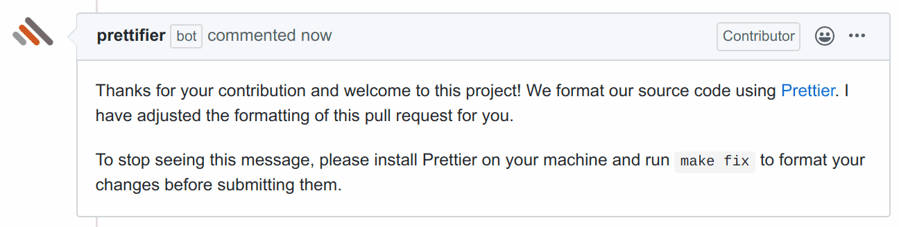

Prettifier modifies people's code. This might surprise some people in your
organization. You can configure Prettifier to comment on pull requests in which
it made changes. Enable this feature via the [prettification
notification]({})
setting.

{} Prettifier adds only one such message per pull request even
when it makes multiple commits. {}
